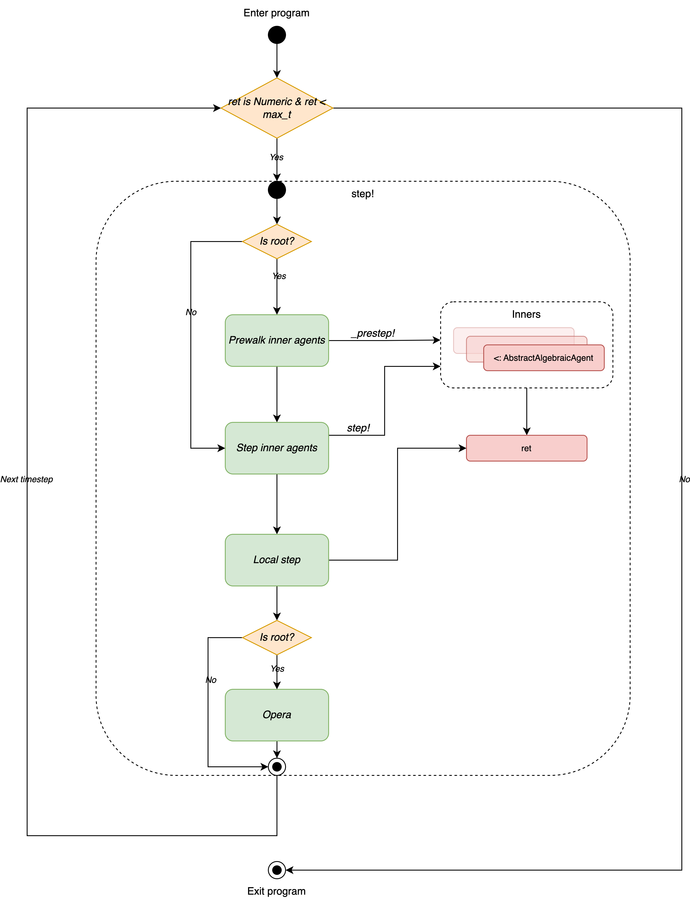

# Framework design

Here we describe the design principles of the AlgebraicAgents. It should be of most use to advanced users and persons interested in contributing to the software. New users are encouraged to start by reading one of the tutorials ("sketches").

## Simulation loop

We describe here the main simulation loop which steps models built in AlgebraicAgents forward in time.

AlgebraicAgents keeps agents synchronized by ensuring that the model will only simulate the agent(s) whose projected time (e.g. the maximum time for which that agent's trajectory has been solved) is the minimum of all agents. For example, if there are 3 agents, whose internal step sizes are of 1, 1.5, and 3 time units, respectively, then at the end of the first step, their projected time will be 1, 1.5, and 3 (assuming they all start at time 0). The simulation will find the minimum of those times and only simulate the agent(s) whose projected time(s) are equal to the minimum. In this case, it is the first agent, who is now projected to time 2 on the second step (other agents are not simulated). Now, the new minimum time is 1.5, and the second agent is projected to time 3 on the third step, etc. The simulation continues until all agents have been projected to their final time point, or the minimum of projected times reaches a maximum time horizon. If all agents take time steps of the same size, then they will all be updated each global step.

There are several functions in the interface for an [`AbstractAlgebraicAgent`](@ref) which implement these dynamics. When defining new agent types, one should implement the [`AlgebraicAgents._step!`](@ref) method, which will step that agent forward if its projected time is equal to the least projected time, among all agents in the hierarchy. Agent types also need to implement [`AlgebraicAgents._projected_to`](@ref), which is crucial to keeping the simulation synchronized. It will return:

  * `nothing` if the agent does not implement its own `_step!` rule (e.g. [`FreeAgent`](@ref) which is a container of agents)
  * `true` if the agent has been projected to the final time point (`_step!` will not be called again)
  * a value of `Number`, giving the time point to which the agent has been projected

These are collected into `ret`, which is an object that will be `true` if and only if all agents have returned `true`, and is otherwise the minimum of the numeric values (projection times) returned from each inner agent's step.

Above we show a caricature of the main simulation loop. "Enter program" corresponds to the call to `simulate`, the value of `ret` is (typically) initialized to `0.0`. The simulation continues to step while `ret` is not `true` (meaning the maximum time horizon has been reached by the slowest agent), or has not exceeded some maximum. 

The inner area enclosed by a dashed border represents where program control is given to the `step!` method. The root agent applies `_prestep!` recurvisely to all of its inner (enclosed) agents. After this, `step!` is then applied to all inner agents, and `ret` is updated by each of them. Then the agent applies its own local update `_step!` if its own projected time is equal to the minimum of all inner agent projected times (not shown). Then the Opera module for additional interactions is called for the root agent.