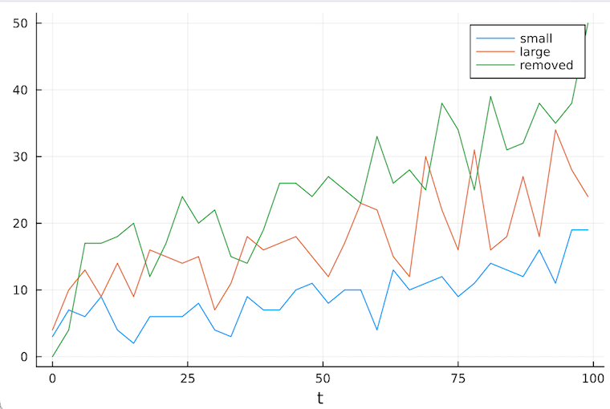

# A Toy Pharma Model

We implement a toy pharma model. To that end, we have the following type hierarchy:

 - overarching **pharma model** (represented by a `FreeAgent` span type),
 - **therapeutic area** (represented by a `FreeAgent`), 
 - **molecules** (small, large - to demonstrate dynamic dispatch; alternatively, marketed drugs; a drug may drop out from the system,
 - **discovery unit** (per therapeutic area); these generate new molecules according to a Poisson counting process,
 - **market demand**; this will be represented by a stochastic differential equation implemented in [DifferentialEquations.jl](https://github.com/SciML/DifferentialEquations.jl).

The next step is to define the molecules and discovery units types. This is done in [there](https://github.com/Merck/AlgebraicAgents.jl/tree/main/tutorials/molecules/types.jl); here we sketch an implementation of `SmallMolecule <: Molecule <: AbstractAlgebraicAgent` type.

```@setup 1
using AlgebraicAgents
include("../../../tutorials/molecules/types.jl")
```

## Integrating a Custom Dynamical System

```@example 1
# drug entity, lives in a therapeutic area 
@aagent FreeAgent Molecule struct SmallMolecule
    age::Float64
    birth_time::Float64
    kill_time::Float64

    mol::AbstractString
    profile::NTuple{N, Float64}

    sales::Float64
    df_sales::DataFrame
end
```

Note the use of a conveniency macro `@aagent` which appends additional fields expected (not required, though) by default interface methods.

Next we provide an evolutionary law for `SmallMolecule` type. This is done by extending the interface function [`AlgebraicAgents._step!`](@ref).

```@example 1
# implement evolution
function AlgebraicAgents._step!(mol::SmallMolecule)
    t = projected_to(mol) # get current time; this equals the time point up to which the mol agent has been projected (enforced via `AlgebraicAgents.step!`)
    # log sales volume at time t
    push!(mol.df_sales, (t, mol.sales))
    # increment mol's age - by default, mols will evolve by unit step
    mol.age += 1
    # apply sales decay in time 
    mol.sales *= sales_decay_small

    # remove mol 1) once sales volume drops below a given level
    # 2) also account for some random effect - prob of removal increases in time
    if (mol.sales <= 10) || (rand() >= exp(-0.2*mol.age))
        mol.kill_time = t
        push!(getagent(mol, "../dx").removed_mols, (mol.mol, t))
        # remove mol from the system
        disentangle!(mol)
    end
end
```

We provide additional methods required by the common interface:

```@example 1
# to reinit the system's state - since we have cold starts here, let's simply remove the mol
AlgebraicAgents._reinit!(mol::Molecule) = disentangle!(mol)
# return time to which the system has been projected
AlgebraicAgents._projected_to(mol::Molecule) = mol.age + mol.birth_time
```

# Adding SDE Models

Let's define toy market demand model and represent this as a stochastic differential equation defined in `DifferentialEquations.jl`

```@example 1
# add SDE models for drug demand in respective areas
using DifferentialEquations

dt = 1//2^(4); tspan = (0.0,100.)
f(u,p,t) = p[1]*u; g(u,p,t) = p[2]*u

prob_1 = SDEProblem(f,g,.9,tspan,[.01, .01])
prob_2 = SDEProblem(f,g,1.2,tspan,[.01, .01])
```

Internally, a discovery unit will adjust its productivity according to the observed market demand:

```julia
# sync with market demand
dx.productivity, = @observables dx "../demand":"demand"
```

# Defining & Entangling the Systems

Next step is to initiate the actual dynamical systems.

```@example 1
# define therapeutic areas
therapeutic_area1 = FreeAgent("therapeutic_area1")
therapeutic_area2 = FreeAgent("therapeutic_area2")

# join therapeutic models into a pharma model
pharma_model = ⊕(therapeutic_area1, therapeutic_area2; name="pharma_model")

# initialize and push discovery units to therapeutic areas
# discovery units evolve at different pace
entangle!(therapeutic_area1, Discovery("dx", 5.2, 10.; dt=3.))
entangle!(therapeutic_area2, Discovery("dx", 6., 8.; dt=5.))

# add SDE models for drug demand in respective areas
demand_model_1 = DiffEqAgent("demand", prob_1, EM(); exposed_ports=Dict("demand" => 1), dt)
demand_model_2 = DiffEqAgent("demand", prob_2, EM(); exposed_ports=Dict("demand" => 1), dt)

# push market demand units to therapeutic areas
entangle!(therapeutic_area1, demand_model_1)
entangle!(therapeutic_area2, demand_model_2)

# show the model
pharma_model
```

```@example 1
getagent(pharma_model, glob"therapeutic_area?/")
```

## Simulating the System

Let's next evolve the compound model over a hundred time units. The last argument is optional here; see `?simulate` for the details.

```@example 1
# let the problem evolve
simulate(pharma_model, 100)
```

```@example 1
getagent(pharma_model, "therapeutic_area1/dx")
```

```@example 1
getagent(pharma_model, "therapeutic_area1/demand")
```

## Plotting

It's possible to provide custom plotting recipes by specializing the interface method `AlgebraicAgents._draw(agent)`. Whenever a dynamical system's state is logged into a single DataFrame - as is the case with `Discovery` type - you may utilize a convenience macro `@draw_df`. To that end, we need to load `DataFrames` and `Plots`.

```julia
# implement plots
using DataFrames, Plots
AlgebraicAgents.@draw_df Discovery df_output
```

To see this in action, call
```julia
draw(getagent(pharma_model, "therapeutic_area1/dx"))
```

