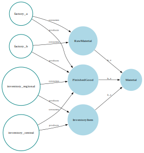

# Summary

AlgebraicAgents.jl is a Julia framework for hierarchical dynamical systems modeling that treats formalism as a per-node choice rather than a global constraint. Differential equations, discrete-event systems, and agent-based models coexist within a single hierarchy, coupled through a minimal stepping interface. The framework supports annotation of information flows between components, visualizing model architecture, and querying relationship structure. Native wrappers for Julia's scientific computing ecosystem enable practitioners to compose domain-specific models into representations of complex dynamics.

# Statement of Need

Modeling dynamical systems at scale—enterprises with interacting business units, multi-physics engineering systems, coupled socioeconomic networks—requires composing components naturally expressed in different formalisms and operating at different temporal granularities. Continuous dynamics govern reactors, discrete events drive logistics, and agent-based rules capture decisions. These subsystems must integrate while remaining independently developable, often beginning as mockups and refined iteratively as data arrives.

This challenge decomposes into three sub-problems:

- **Multi-formalism coupling.** Subsystems should be expressible in different formalisms, such as ODEs, discrete-time systems, or agent-based models, at varying granularity, with the framework facilitating their coupling.
- **Hierarchical modularity.** Subsystems should support independent development, validation, and reuse as building blocks within larger models.
- **Semantic transparency.** Visualizing and querying information flows across models should support both validation and explainability.

Prior work addresses aspects of this challenge. The Functional Mock-up Interface [@Blochwitz2011] standardizes co-simulation of black-box models but imposes protocol overhead suited to industrial interoperability rather than rapid prototyping. Meta-modeling frameworks like the Generic Modeling Environment [@Ledeczi2001] operate at a higher abstraction, enabling construction of domain-specific formalisms. The Ptolemy project [@Ptolemy] and Lingua Franca [@Menard2023] provide principled foundations for heterogeneous component interaction across concurrent, real-time, and distributed settings.

Within the Julia ecosystem [@Julia2017], ModelingToolkit.jl [@Ma2021; @DifferentialEquations2017], and its commercial extension, JuliaHub's Dyad, excel at symbolic-numeric modeling and equation-based composition but do not naturally accommodate discrete or agent-based dynamics. AlgebraicDynamics.jl [@Brown2022; @Baez2023] brings categorical semantics to dynamical systems yet enforces strict interface typing that constrains exploratory work.

AlgebraicAgents.jl relaxes formalism and shifts focus towards compositional flexibility. Any agent can access any other agent's state, and synchronization is temporal rather than type-enforced. This design prioritizes iteration speed and introspection over type-enforced interface contracts, a trade-off suited to exploratory modeling, where specifications evolve alongside understanding.

# Software Design

The central abstraction of the framework is the *agent*, which serves a dual role. First, an agent implements a dynamical system with a custom evolution rule, exposing its internal clock and state variables as observable quantities to other agents. Second, an agent acts as a node in a rooted tree hierarchy, serving as a container for nested child agents, each of which is itself an agent with this   dual character.

Agents are implemented as Julia structures that subtype `AbstractAlgebraicAgent`. The `@aagent` macro provides a lightweight inheritance mechanism, automatically including common interface fields while permitting user-defined fields:

```julia
@aagent struct InventoryAgent
    stock_level::Int
    reorder_time::Int
end
```

# Synchronized Evolution

Each agent implements `_step!`, which advances its state and returns the time on its internal clock, that is, the furthest point for which its trajectory has been computed. The simulation loop coordinates agents by identifying the minimum projected time across the hierarchy and stepping only those agents at that frontier.

This mechanism is exemplified below for the case of three agents A, B, and C.

| Global Step | Agent A (Δt=1) | Agent B (Δt=1.5) | Agent C (Δt=3) | Frontier (min) | Stepped |
|:-----------:|:--------------:|:----------------:|:--------------:|:--------------:|:-------:|
| 0 (init)    | 0              | 0                | 0              | 0              | —       |
| 1           | **1**          | **1.5**          | **3**          | 1              | A, B, C |
| 2           | **2**          | 1.5              | 3              | 1.5            | A       |
| 3           | 2              | **3**            | 3              | 2              | B       |
| 4           | **3**          | 3                | 3              | 3              | A       |
| 5           | **4**          | **4.5**          | **6**          | 4              | A, B, C |

Formally, the single step of the simulator is defined as follows.

```julia
function step!(a::Agent, t=projected_to(a))
    # Recurse depth-first.
    t_min = minimum(step!(c, t) for c in children(a); init=nothing)
    
    # Step only agents at the time frontier.
    projected_to(a) == t && _step!(a)
    
    return something(t_min, projected_to(a))
end
```

For models where an agent with a shorter step queries another agent already projected further ahead, *observables* mitigate temporal inconsistency. Agents expose state variables through `gettimeobservable`, which can implement interpolation or extrapolation logic.

We note that during the evolutionary step, any agent in the system can be accessed and modified.

Beyond evolutionary stepping, the framework supports three callback types:

| Callback Type | Execution Timing | Typical Use Case |
|---------------|------------------|------------------|
| **Futures** | At predetermined time | Scheduled events, delayed triggers |
| **Controls** | Every solver step | Invariant enforcement, monitoring |
| **Instantaneous** | Within current step | Intra-step coordination, priority-ordered effects |

# Topology, Wires, and Relations

Each agent occupies a node in a tree topology. Path-based references enable navigation: `getagent(a, "../sibling/child")`. Container agents with trivial evolution organize subsystems into logical compartments, enabling modular development and hierarchical visualization.

Beyond the execution hierarchy, *wires* explicitly declare directed information flows between agents. While agents can programmatically access any other agent's state, declared wires serve as documentation and enable dependency analysis:

```julia
add_wire!(full_system; 
        from=factory_a_main, to=inventory_central_main,
        from_var_name="output_volume", to_var_name="incoming_stock")
```


*Concepts* represent atemporal notions—resources, constraints, abstractions—that participate in relations alongside agents. This enables modeling of "what" (materials, approvals, markets) separate from "how" (processes), supporting dependency queries and ontological visualization. Both agents and concepts belong to the union type `RelatableType`, enabling *relations* to connect any pair with typed labels:

```julia
c_finished_good = Concept("FinishedGood", Dict(:type => "product"))
add_relation!(factory_a, c_finished_good, :produces)
```



These semantic annotations support Graphviz visualization and structured queries over model architecture.

# Integrations

AlgebraicAgents.jl provides native wrappers for Julia's scientific modeling ecosystem. `DiffEqAgent` wraps `DEProblem` instances from DifferentialEquations.jl, enabling ODEs, SDEs, DDEs, and DAEs to participate in hierarchical simulations. Integration with Agents.jl [@Agents2022] allows agent-based models to compose with continuous or discrete dynamical systems. `GraphicalAgent` wraps `AbstractResourceSharer` or `AbstractMachine` from AlgebraicDynamics.jl, providing compatibility with categorical composition patterns. Visualization functions generate Graphviz DOT and Mermaid diagram output for documentation.

# Availability and Documentation

AlgebraicAgents.jl is registered in Julia's General registry. [API documentation](https://merck.github.io/AlgebraicAgents.jl/stable/) and a [comprehensive example](https://merck.github.io/AlgebraicAgents.jl/stable/sketches/molecules/molecules.html)—a synthetic pharmaceutical company model—are available online. Contributions welcome via [GitHub](https://github.com/Merck/AlgebraicAgents.jl/). The framework is licensed as MIT license.

# Research Impact Statement

The framework has been applied to develop proprietary pharmaceutical value chain models. Two companion packages by the authors extend this foundation: [ReactiveDynamics.jl](https://github.com/Merck/ReactiveDynamics.jl), providing chemical reaction network–inspired syntax for business process modeling natively compatible with AlgebraicAgents.jl, and [CEEDesigns.jl](https://github.com/Merck/CEEDesigns.jl), implementing Bayesian cost-efficient experimental design for drug discovery.

# AI Usage Disclosure

The authors used Claude Opus 4.5 (Anthropic) for editorial refinement and proofreading of the manuscript. The authors reviewed and validated all suggested edits and bear full responsibility for the accuracy of the final manuscript.

# References