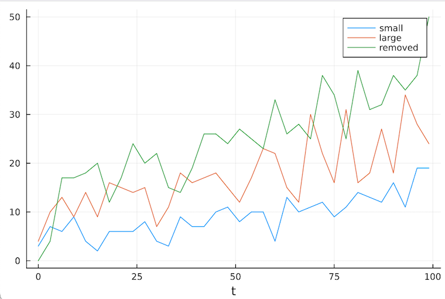

# AlgebraicAgents.jl: <br> Dynamical Systems Co-Integration Framework

<p align="center">
  <a href="#about">About</a> |
  <a href="#context-dynamics-of-value-evolution-dyve">Context</a> |
  <a href="#a-single-sketch">A Single Sketch</a> |
  <a href="https://merck.github.io/AlgebraicAgents.jl/">Documentation</a>
</p>

## About

A lightweight framework to enable **hierarchical, heterogeneous** dynamical systems **co-integration**. *Batteries included!*

<a></a>

<p><b>Entangle dynamical systems</b>
<ul>
 <li> Simulate joint evolution of dynamical systems from across the Julia ecosystem</li>
 <li> Each of the systems can evolve at its own pace - the framework will keep them in sync</li>
 <li> The systems may access each other's (interpolated) observables</li>
</ul>

<b>Organize systems into hierarchies</b>
<ul>
 <li> A dynamical system may contain an embedded hierarchy of agents</li>
 <li> The systems are indexed as folders in a file system - even wildcards are supported</li>
 <li> You may take sums of dynamical systems - and override default ⊕ to embrace custom system classes</li>
</ul>
</p>

The package solves a typical **scaling problem**: while modeling a complex system, one tears the joint dynamics into several parts, but inevitably runs into troubles when trying to put these parts together. 

We provide a minimalistic **interface** featuring compositions of dynamical systems, to **approximate the joint dynamics** from separate systems' evolutionary laws. In practice, one only has to define a **wrap type** for a custom dynamical system class and implement a handful of **common interface methods**. So far, integrations of [DifferentialEquations.jl](https://github.com/SciML/DifferentialEquations.jl), [Agents.jl](https://github.com/JuliaDynamics/Agents.jl), and [AlgebraicDynamics.jl](https://github.com/AlgebraicJulia/AlgebraicDynamics.jl) are provided, see the [docs](https://merck.github.io/AlgebraicAgents.jl/#Loading-third-party-package-integrations).

The dynamical systems are organized into **hierarchies**. That is, a dynamical system may contain an embedded hierarchy of dynamical systems. Each system is then assigned a **path** in the overarching hierarchy, like a folder in a file system. A dynamical system typically indexes and retrieves other systems in the hierarchy via relative paths.

The underlying concept of a **sum** (a join) of dynamical systems is manifested at two distinct levels: first, the dynamical systems are **implicitly coupled** as they generally observe (and interact with) each other's state. Second, a structural sum **⊕** operator is provided; this outputs another dynamical system which usually contains the summands within a hierarchy of embedded systems. Importantly, using Julia's **dynamic dispatch**, it is possible to fully customize this behavior for user-defined dynamical system classes.

## Context: Dynamics of Value Evolution (DyVE)
 
The package is an integral part of the **Dynamics of Value Evolution (DyVE)** computational framework for learning, designing, integrating, simulating, and optimizing R&D process models, to better inform strategic decisions in science and business.
 
As the framework evolves, multiple functionalities have matured enough to become standalone packages.

This includes **[ReactiveDynamics.jl](https://github.com/Merck/ReactiveDynamics.jl)**, a package which implements a category of reaction (transportation) network-type dynamical systems. The central concept of the package is of a stateful, parametric transition; simultaneous action of the transitions then evolves the dynamical system. Moreover, a network's dynamics can be specified using a compact modeling metalanguage.
 
Another package is **[GeneratedExpressions.jl](https://github.com/Merck/GeneratedExpressions.jl)**, which implements a metalanguage to support code-less expression comprehensions. In the context of ReactiveDynamics.jl, expression comprehensions are used to generate complex dynamics from user-specified template transitions.

## A Single Sketch

## Integrating a Custom Dynamical System

```julia
# drug entity, lives in a therapeutic area
@aagent SmallMolecule Molecule begin
    age::Float64
    birth_time::Float64
    kill_time::Float64

    mol::AbstractString
    profile::NTuple{N, Float64}

    sales::Float64
    df_sales::DataFrame
end
```

Note the use of a conveniency macro `@aagent` which appends additional fields expected (not required, though) by default interface methods.

Next we provide an evolutionary law for `SmallMolecule` type. This is done by extending the interface function `AlgebraicAgents._step!(agent, t::Float64)`.

Here, `t` is the maximal time to which all the systems in a hierarchy have been projected. Once `t` reaches the time point to which `mol` has been projected, then it's time for another step:

```julia
# implement evolution
function AlgebraicAgents._step!(mol::SmallMolecule, t)
    if t === (mol.age + mol.birth_time)
        # log sales volume at time t
        push!(mol.df_sales, (t, mol.sales))
        # increment mol's age - by default, mols will evolve by unit step
        mol.age += 1
        # apply sales decay in time
        mol.sales *= sales_decay_small

        # remove mol 1) once sales volume drops below a given level
        # 2) also account for some random effect - prob of removal increases in time
        if (mol.sales <= 10) || (rand() >= exp(-0.2*mol.age))
            mol.kill_time = t
            push!(getagent(mol, "../dx").removed_mols, (mol.mol, t))
            # remove mol from the system
            disentangle!(mol)
        end
    end

    # return time to which the system has been projected
    mol.age + mol.birth_time
end
```


We provide additional methods required by the common interface:


```julia
# to reinit the system's state - since we have cold starts here, let's simply remove the mol
AlgebraicAgents._reinit!(mol::Molecule) = disentangle!(mol)
# return time to which the system has been projected
AlgebraicAgents._projected_to(mol::Molecule) = mol.age + mol.birth_time
```

### Adding SDE Models


Let's define toy market demand model and represent this as a stochastic differential equation defined in `DifferentialEquations.jl`


```julia
# add SDE models for drug demand in respective areas
using DifferentialEquations

dt = 1//2^(4); tspan = (0.0,100.)
f(u,p,t) = p[:α]*u; g(u,p,t) = p[:β]*u

prob_1 = SDEProblem(f,g,.9,tspan,Dict{Symbol, Any}(:α=>.01, :β=>.01))
prob_2 = SDEProblem(f,g,1.2,tspan,Dict{Symbol, Any}(:α=>.005, :β=>.01))
```


```julia
SDEProblem with uType Float64 and tType Float64. In-place: false
timespan: (0.0, 100.0)
u0: 1.2
```

Internally, a discovery unit will adjust its productivity according to the observed market demand:

```julia
# sync with market demand
dx.productivity, = @observables dx "../demand":"demand"
```

### Defining & Entangling the Systems


Next step is to initiate the actual dynamical systems.

```julia
# define therapeutic areas
therapeutic_area1 = FreeAgent("therapeutic_area1")
therapeutic_area2 = FreeAgent("therapeutic_area2")

# join therapeutic models into a pharma model
pharma_model = ⊕(therapeutic_area1, therapeutic_area2; name="pharma_model")

# initialize and push discovery units to therapeutic areas
# discovery units evolve at different pace
entangle!(therapeutic_area1, Discovery("dx", 5.2, 10.; dt=3.))
entangle!(therapeutic_area2, Discovery("dx", 6., 8.; dt=5.))

# add SDE models for drug demand in respective areas
demand_model_1 = DiffEqAgent("demand", prob_1, EM(); exposed_ports=Dict("demand" => 1), dt)
demand_model_2 = DiffEqAgent("demand", prob_2, EM(); exposed_ports=Dict("demand" => 1), dt)

# push market demand units to therapeutic areas
entangle!(therapeutic_area1, demand_model_1)
entangle!(therapeutic_area2, demand_model_2)

# show the model
pharma_model
```

```julia
agent pharma_model with uuid 05e79978 of type FreeAgent 
   inner agents: 
    agent therapeutic_area1 with uuid 8b7ac56f of type FreeAgent 
       inner agents: demand, dx
    agent therapeutic_area2 with uuid 6c749c0f of type FreeAgent 
       inner agents: demand, dx
```


```julia
getagent(pharma_model, glob"therapeutic_area?/")
```


```julia
2-element Vector{FreeAgent}:
 FreeAgent{name=therapeutic_area2, uuid=6c749c0f, parent=FreeAgent{name=pharma_model, uuid=05e79978, parent=nothing}}
 FreeAgent{name=therapeutic_area1, uuid=8b7ac56f, parent=FreeAgent{name=pharma_model, uuid=05e79978, parent=nothing}}
```

### Simulating the System


Let's next evolve the compound model over a hundred time units. The last argument is optional here; see `?simulate` for the details.


```julia
# let the problem evolve
simulate(pharma_model, 100)
```


```julia
agent pharma_model with uuid 05e79978 of type FreeAgent 
   inner agents: 
    agent therapeutic_area1 with uuid 8b7ac56f of type FreeAgent 
       inner agents: yBh8n, NL9OQ, IfnJm, jB2XS, YKXlR, hEjuU, TPT6A, G3KGF, dx, 0CBpW, Vj3wm, LgNCo, jBF5x, ankr2, nN8iW, 9XjQX, y3YVk, PRejO, KR4Vl, 5HktC, 4dHax, arRnv, AhPe7, 5tnsD, qqkxY, kOjsf, q2zm5, Np78L, Jlzf7, DYVji, iafx4, b1WsV, ph5PO, NmmaJ, ZQrZK, kyEmh, Szewc, Y6i1A, EEFIu, g8Kuc, p8lgB, RBFqP, 3ndHM, oqWwt, HHKxT, ck6Kh, kQ9lL, qUr9S, GWYI8, PApQn, yitPS, iD5oS, 4EQqz, pCUle, rpXFX, 9295B, aLG3w, z2dTa, T2Cg7, nF00k, demand, g3vDH, KZ423, HcGru, yh9qU, m9u9r, HNZPr, 2p5VX, WKh1Y, DXarI, TFmHm, uGhAj, Medas, MgoKV, KGgP4, llnyd, lTTiZ, doSkK, ZfhWv, XRbpr, FKCI3, ys9UH, l5gVu, N4xmD, PjsRa, ouR7H, ym4Tb, KVYTB, 6YEHf, eyprJ, WBV4y, J92xS, bfsxh, Z57dn, smhsk, ZjoM4, tu9vN, lnUVB, PqUab, oiJOb, rZHlz
    agent therapeutic_area2 with uuid 6c749c0f of type FreeAgent 
       inner agents: dx, aIcFE, qDfar, demand
```


```julia
getagent(pharma_model, "therapeutic_area1/dx")
```


```julia
agent dx with uuid af488692 of type Main.Discovery 
   custom properties:
   rate_small: 5.2
   rate_large: 10.0
   productivity: 2.3297332635836594
   t: 102.0
   dt: 3.0
   t0: 0.0
   removed_mols: [("DGSLp", 99.0), ("Grjue", 99.0), ("s8c3x", 99.0), ("NLbHs", 99.0), ("DsTSW", 99.0), ("Qzokp", 99.0), ("8BFqZ", 99.0), ("YVKb0", 99.0), ("pRKig", 99.0), ("x3Sbn", 99.0)  …  ("Qq6Rs", 99.0), ("C4bqV", 99.0), ("Ic9YH", 99.0), ("D5emm", 99.0), ("VW0lS", 99.0), ("Dez7v", 99.0), ("z0VjL", 99.0), ("w9LBP", 99.0), ("0Aq1f", 99.0), ("i27ZG", 99.0)]
   df_output: 34×4 DataFrame
 Row │ time     small  large  removed
     │ Float64  Int64  Int64  Int64
─────┼────────────────────────────────
   1 │     0.0     16     32        0
   2 │     3.0     21     26       38
   3 │     6.0      8     22       46
   4 │     9.0     22     22       33
   5 │    12.0     16     34       45
   6 │    15.0     13     39       44
   7 │    18.0     14     27       56
   8 │    21.0     18     31       42
  ⋮  │    ⋮       ⋮      ⋮       ⋮
  28 │    81.0     14     58       98
  29 │    84.0     24     62       80
  30 │    87.0     39     70       74
  31 │    90.0     42     69      121
  32 │    93.0     38     74      107
  33 │    96.0     38     87       95
  34 │    99.0     42     74      133
                       19 rows omitted
   parent: therapeutic_area1
```


```julia
getagent(pharma_model, "therapeutic_area1/demand")
```

```julia
agent demand with uuid 18d7fbd7 of type DiffEqAgent 
   custom properties:
   integrator: 
t: 100.0
u: 2.3580108744816726
   ports out: demand
   parent: therapeutic_area1
```

### Plotting

It's possible to provide custom plotting recipes by specializing the interface method `AlgebraicAgents._draw(agent)`. Whenever a dynamical system's state is logged into a single DataFrame - as is the case with `Discovery` type - you may utilize a convenience macro `@draw_df`. To that end, we need to load both `DataFrames` and `Plots`.


```julia
# implement plots
using DataFrames, Plots
AlgebraicAgents.@draw_df Discovery df_output
```

To see this in action, call

```julia
draw(getagent(pharma_model, "therapeutic_area1/dx"))
```


